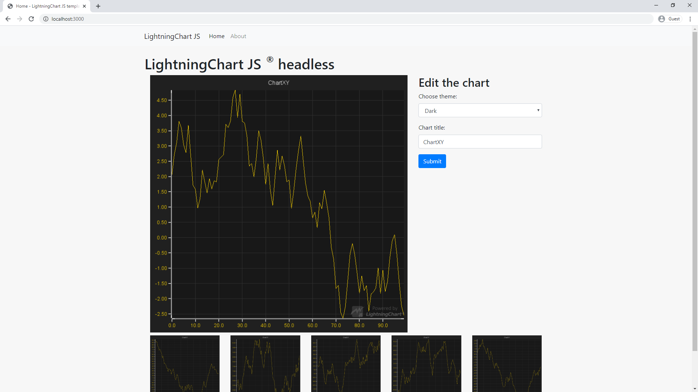

# LightningChart JS Node JS server template



Express based server template, showcasing how to use the [`@arction/lcjs-headless`][lcjs-headless-npm] package to render charts with [LightningChart JS][lightningchart-js] on server environment.

This template is heavily influenced by the Microsoft's [TypeScript-Node-Starter][ts-node-starter] template.

## Requirements

* Node JS
* See the `@arction/lcjs-headless` Readme for specific requirements for your operating system and environment.

## Getting Started

1. Clone the repository

```
git clone --depth=1 https://github.com/Arction/lcjs-node-template.git <project_name>
```

2. Install project dependencies

```
cd <project_name>
npm install
```

3. Build and run the project

```
npm run build
npm run start
```

4. Open a browser and navigate to `http://localhost:3000`

[lcjs-headless-npm]: https://www.npmjs.com/package/@arction/lcjs-headless
[lightningchart-js]: https://www.arction.com/lightningchart-js/
[ts-node-starter]: https://github.com/microsoft/TypeScript-Node-Starter
